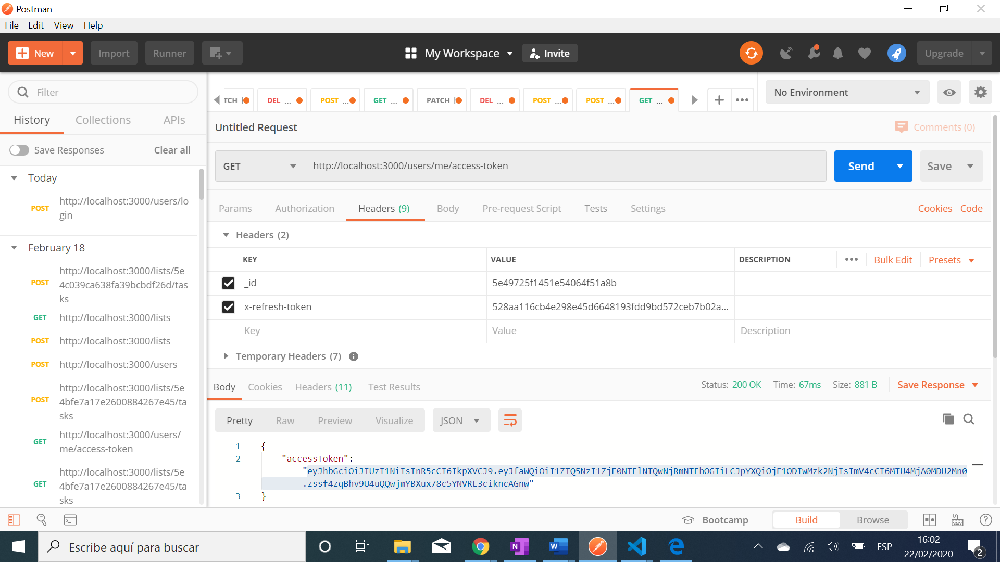
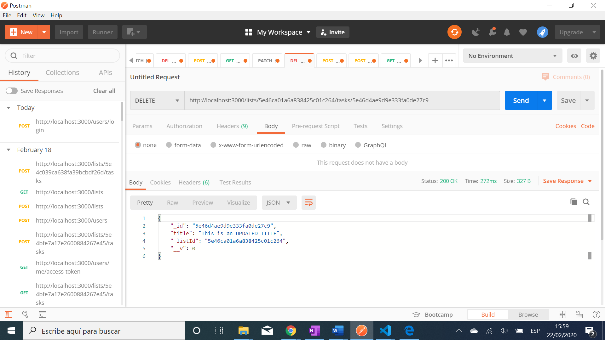
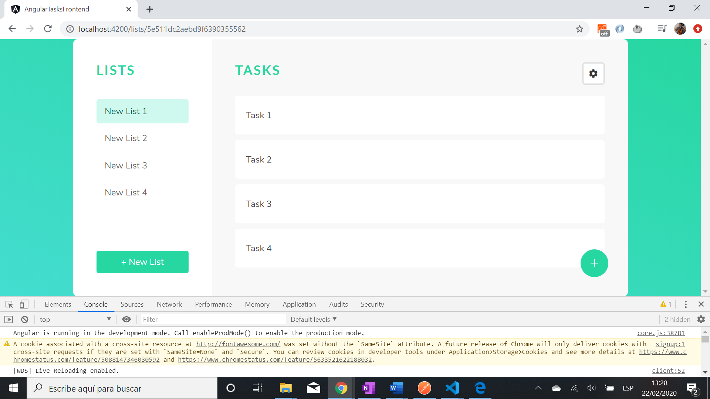

# :zap: MEAN Stack Task Manager - Tutorial Code by Devstakr

* See `angular-tasks-frontend` folder for Angular frontend code.
* See `api` folder for backend API using Node.js with Mongoose and Express.
* All code by [Devstackr](https://www.youtube.com/channel/UCbwsS1m4Hib6R-9F1alus_A/featured).

## :page_facing_up: Table of contents

* [:zap: MEAN Stack Task Manager - Tutorial Code by Devstakr](#zap-mean-stack-task-manager---tutorial-code-by-devstakr)
  * [:page_facing_up: Table of contents](#page_facing_up-table-of-contents)
  * [:books: General info](#books-general-info)
  * [:camera: Screenshots](#camera-screenshots)
  * [:signal_strength: Technologies](#signal_strength-technologies)
  * [:floppy_disk: Setup](#floppy_disk-setup)
  * [:clipboard: Status & To-do list](#clipboard-status--to-do-list)
  * [Inspiration](#inspiration)
  * [:envelope: Contact](#envelope-contact)

## :books: General info

* Note: it is not possible to see the Mongodb results on `http://localhost:27017/TaskManager` because: the Angular app has to communicate with the Express server app (using get, post etc.), and the Express server app will communicate with the MongoDB server. The Angular app cannot communicate with the MongoDB server directly (due to potential security issues)

## :camera: Screenshots

## :signal_strength: Technologies

* See `angular-tasks-frontend` and `api` backend folders for technologies used
* [Postman v7](https://www.postman.com/downloads/) API Dev Environment used to test app

## :floppy_disk: Setup

* See `angular-tasks-frontend` and `api` backend folders for individual setups. You need to have both front and back ends running for the app to work.

## :clipboard: Status & To-do list

* Status: Working
* All 15 tutorials completed. User can sign up and login
* Frontend updated to latest version of Angular 10
* Lists and Task can be created with front and back ends working together & backend connects with a Mongodb database
* Postman successfully used to test POST, GET, PATCH, DELETE lists and tasks in a list
* Authentication middleware added to all API routes so user can only ever Create, Read, Update or Delete their own lists/tasks
* Front and back ends pass data via localhost://3000

* To-do: Change to cloud MngoDB. Add comments. Add check if signup user already exists - currently causes an error. Add logout function.

## Inspiration

* [Project Demo & Introduction - [1] Build a Task Manager w/ Angular, NodeJS and MongoDB](https://www.youtube.com/watch?v=V-CeWkz1MNQ&list=PLIjdNHWULhPSZFDzQU6AnbVQNNo1NTRpd&index=1)
* [Creating the UI (Angular) - [2] Build a Task Manager w/ Angular, NodeJS and MongoDB](https://www.youtube.com/watch?v=BO67e3QU9dU&list=PLIjdNHWULhPSZFDzQU6AnbVQNNo1NTRpd&index=2)
* [Building the API | NodeJS, Express and Mongoose - [3] Build a Task Manager w/ MEAN Stack](https://www.youtube.com/watch?v=P3R-8jj3S7U&list=PLIjdNHWULhPSZFDzQU6AnbVQNNo1NTRpd&index=3)
* [Connecting Angular Frontend to the API - [4] Build a Task Manager w/ Angular, NodeJS and MongoDB](https://www.youtube.com/watch?v=185uAxYz1dU&list=PLIjdNHWULhPSZFDzQU6AnbVQNNo1NTRpd&index=4)
* [Creating Lists and Displaying in Sidebar - [5] Build a Task Manager w/ Angular, NodeJS and MongoDB](https://www.youtube.com/watch?v=aOkAx1jZokc&list=PLIjdNHWULhPSZFDzQU6AnbVQNNo1NTRpd&index=5)
* [New Task Button (FAB) - [6] Build a Task Manager w/ Angular, NodeJS and MongoDB](https://www.youtube.com/watch?v=7YK4pJZG0oA&list=PLIjdNHWULhPSZFDzQU6AnbVQNNo1NTRpd&index=6)
* [Creating the New Task Page - [7] Build a Task Manager w/ Angular, NodeJS and MongoDB](https://www.youtube.com/watch?v=z6Le35tGFRg&list=PLIjdNHWULhPSZFDzQU6AnbVQNNo1NTRpd&index=7)
* [Setting Tasks to Completed - [8] Build a Task Manager w/ Angular, NodeJS and MongoDB](https://www.youtube.com/watch?v=PUvPNdVphtQ&list=PLIjdNHWULhPSZFDzQU6AnbVQNNo1NTRpd&index=8)
* [Users & Authentication (API) - [9] Build a Task Manager w/ Angular, NodeJS and MongoDB](https://www.youtube.com/watch?v=NPyFYsZb2gE&list=PLIjdNHWULhPSZFDzQU6AnbVQNNo1NTRpd&index=9)
* [Starting Angular Authentication - [10] Build a Task Manager w/ Angular, NodeJS and MongoDB](https://www.youtube.com/watch?v=Fa2imVkcdqs&list=PLIjdNHWULhPSZFDzQU6AnbVQNNo1NTRpd&index=10)
* [Protecting API Routes - [11] Build a Task Manager w/ Angular, NodeJS and MongoDB](https://www.youtube.com/watch?v=_MyUWj-AT8s&list=PLIjdNHWULhPSZFDzQU6AnbVQNNo1NTRpd&index=11)
* [Handling Access Token Refresh on Frontend - [12] Build a Task Manager w/ Angular, NodeJS and MongoDB](https://www.youtube.com/watch?v=aACLcXR0kls&list=PLIjdNHWULhPSZFDzQU6AnbVQNNo1NTRpd&index=12)
* [Signup Page - [13] Build a Task Manager w/ Angular, NodeJS and MongoDB](https://www.youtube.com/watch?v=kiImo42Nfs0&list=PLIjdNHWULhPSZFDzQU6AnbVQNNo1NTRpd&index=13)
* [Updating and Deleting Lists & Tasks - [14] Build a Task Manager w/ Angular, NodeJS and MongoDB](https://www.youtube.com/watch?v=XM-1lNLuJjg&list=PLIjdNHWULhPSZFDzQU6AnbVQNNo1NTRpd&index=14)
* [Finishing up - [15] Build a Task Manager w/ Angular, NodeJS and MongoDB](https://www.youtube.com/watch?v=HuC9YebfPMQ&list=PLIjdNHWULhPSZFDzQU6AnbVQNNo1NTRpd&index=15)
* [Devstackr: Github repo](https://github.com/Devstackr/task-manager-mean-stack)
* [Auth0: Refresh Tokens: When to Use Them and How They Interact with JWTs](https://auth0.com/blog/refresh-tokens-what-are-they-and-when-to-use-them/)

## :envelope: Contact

* Repo created by [ABateman](https://www.andrewbateman.org) - you are welcome to [send me a message](https://andrewbateman.org/contact)
