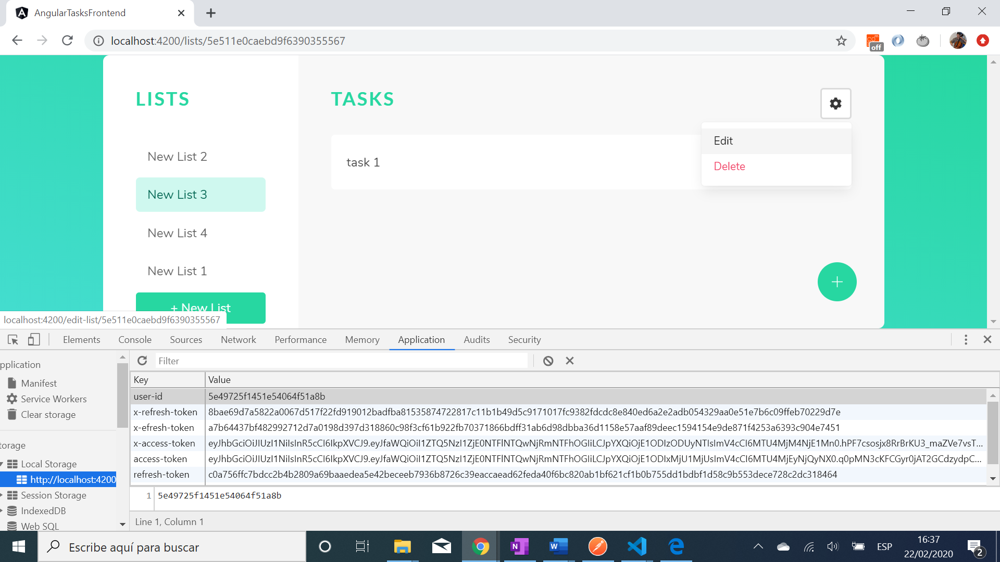

# :zap: Angular Frontend for MEAN Stack Task Manager - Tutorial Code by Devstakr

* All code by [Devstackr](https://www.youtube.com/channel/UCbwsS1m4Hib6R-9F1alus_A/featured).

## :page_facing_up: Table of contents

* [:zap: Angular Frontend for MEAN Stack Task Manager - Tutorial Code by Devstakr](#zap-angular-frontend-for-mean-stack-task-manager---tutorial-code-by-devstakr)
  * [:page_facing_up: Table of contents](#page_facing_up-table-of-contents)
  * [:books: General info](#books-general-info)
  * [:camera: Screenshots](#camera-screenshots)
  * [:signal_strength: Technologies](#signal_strength-technologies)
  * [:floppy_disk: Setup](#floppy_disk-setup)
  * [:computer: Code Examples](#computer-code-examples)
  * [:cool: Features](#cool-features)

## :books: General info

* Angular 11 used to provide a user frontend interface to Create, Read, Update, and Delete (CRUD) lists and tasks.
* Includes pages for signup and login.

## :camera: Screenshots




## :signal_strength: Technologies

* [Angular v11](https://angular.io/)
* [Fontawesome](https://fontawesome.com/kits/b7c269bd48/use) how to add kit number to html header
* [Bulma v0.9.1](https://bulma.io/documentation/) CSS framework
* [rxjs v6](https://angular.io/guide/rx-library) reactive programming library
* [RxJS shareReplay](https://www.learnrxjs.io/learn-rxjs/operators/multicasting/sharereplay) Share source and replay specified number of emissions on subscription.

## :floppy_disk: Setup

* Run `npm i` to install dependencies
* Run `ng serve` to start the server on _localhost://4200_

## :computer: Code Examples

* Signup function - uses authService signup function

```typescript
// sign-up page. Subscribe to response from authService signup
onSignupButtonClicked(email: string, password: string) {
  this.authService.signup(email, password).subscribe((res: HttpResponse<any>) => {
    console.log(res);
    this.router.navigate(['/lists']);
  });
}
// auth.service.ts
signup(email: string, password: string) {
  return this.webService.signup(email, password).pipe(
    shareReplay(),
    tap((res: HttpResponse<any>) => {
      // auth tokens will be in the header
      this.setSession(res.body._id, res.headers.get('x-access-token'), res.headers.get('x-refresh-token'));
      console.log('Successfully signed up and logged in');
    })
  )
}

// web-request.service.ts post user signup data to backend api
signup(email: string, password: string) {
  return this.http.post(`${this.ROOT_URL}/users`, {
    email,
    password
  }, {
    observe: 'response'
  });
}
```

## :cool: Features

* Successful sign up or login redirects (new) user to task lists page.
