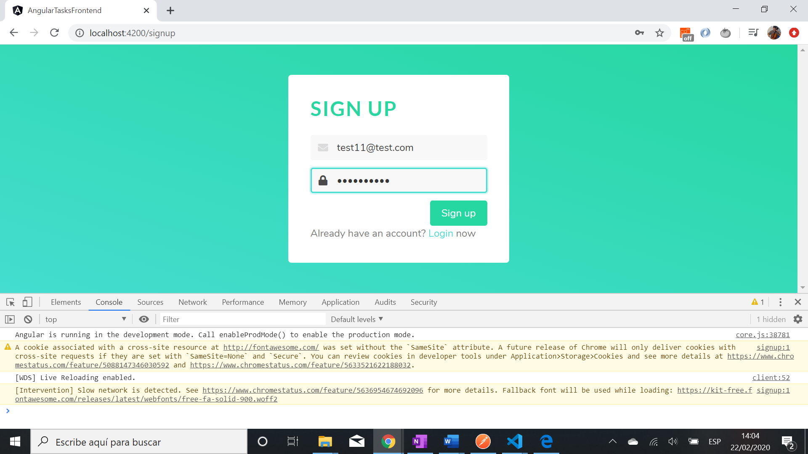
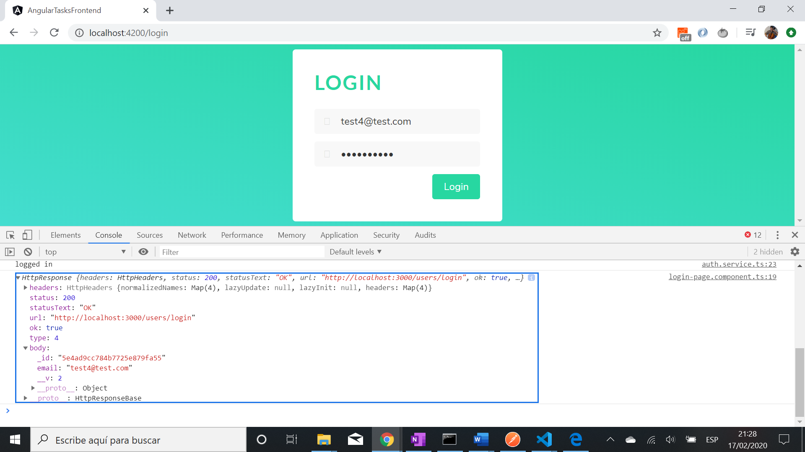

# Angular Frontend for MEAN Stack Task Manager - Tutorial Code by Devstakr

* All code by [Devstackr](https://www.youtube.com/channel/UCbwsS1m4Hib6R-9F1alus_A/featured).

## Table of contents

* [General info](#general-info)
* [Screenshots](#screenshots)
* [Technologies](#technologies)
* [Setup](#setup)
* [Features](#features)
* [Status](#status)
* [Inspiration](#inspiration)
* [Contact](#contact)

## General info

* Angular 8 used to provide a user frontend interface to Create, Read, Update, and Delete (CRUD) lists and tasks. Pages for signup and login.

## Screenshots





## Technologies

* [Angular v8.2.14](https://angular.io/)
* [Angular material v8.2.3](https://material.angular.io/)
* [Fontawesome](https://fontawesome.com/kits/b7c269bd48/use) how to add kit number to html header
* [Bulma v0.8.0](https://bulma.io/documentation/) CSS framework
* [rxjs v6.4.0](https://angular.io/guide/rx-library) reactive programming library
* [RxJS shareReplay](https://www.learnrxjs.io/learn-rxjs/operators/multicasting/sharereplay) Share source and replay specified number of emissions on subscription.

## Setup

* To start the server on _localhost://4200_ type: 'ng serve'

## Code Examples

* Signup function - uses authService signup function

```typescript
// sign-up page
onSignupButtonClicked(email: string, password: string) {
    this.authService.signup(email, password).subscribe((res: HttpResponse<any>) => {
      console.log(res);
      this.router.navigate(['/lists']);
    });
  }
  // auth.service.ts
  signup(email: string, password: string) {
    return this.webService.signup(email, password).pipe(
      shareReplay(),
      tap((res: HttpResponse<any>) => {
        // auth tokens will be in the header
        this.setSession(res.body._id, res.headers.get('x-access-token'), res.headers.get('x-refresh-token'));
        console.log('Successfully signed up and logged in');
      })
    )
  }

  // web-request.service.ts post user signup data to backend api
  signup(email: string, password: string) {
    return this.http.post(`${this.ROOT_URL}/users`, {
      email,
      password
    }, {
      observe: 'response'
    });
  }
```

## Features

* Successful sign up or logic redirects (new) user to list page.
