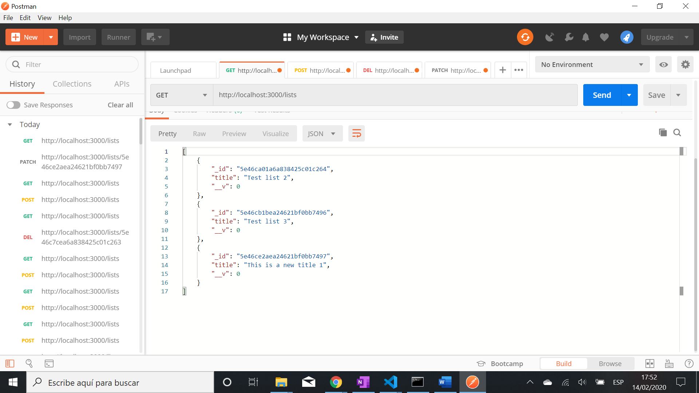

# :zap: NodeJS Backend for MEAN Stack Task Manager - Tutorial Code by Devstackr

* All code by [Devstackr](https://www.youtube.com/channel/UCbwsS1m4Hib6R-9F1alus_A/featured).

## :page_facing_up: Table of contents

* [:zap: NodeJS Backend for MEAN Stack Task Manager - Tutorial Code by Devstackr](#zap-nodejs-backend-for-mean-stack-task-manager---tutorial-code-by-devstackr)
  * [:page_facing_up: Table of contents](#pagefacingup-table-of-contents)
  * [:books: General info](#books-general-info)
  * [:camera: Screenshots](#camera-screenshots)
  * [:signal_strength: Technologies](#signalstrength-technologies)
  * [:floppy_disk: Setup](#floppydisk-setup)
  * [:computer: Code Examples](#computer-code-examples)
  * [:cool: Features](#cool-features)

## :books: General info

* Backend API using Node.js with Mongoose and Express
* Includes sign-up/log-in using JWT authentication web tokens
* If local storage cleared via google dev tools Application-Storage then app correctly reverts to /login page.

## :camera: Screenshots



## :signal_strength: Technologies

* [Node.js v12](https://nodejs.org/en/) asynchronous event-driven JavaScript runtime built on Chrome's V8 JavaScript engine.
* [Mongoose v5](https://mongoosejs.com/) mongodb object modeling for node.js
* [Lodash v4](https://lodash.com/) Javascript utility library
* [bcryptjs v2](https://www.npmjs.com/package/bcrypt) password hashing function
* [jsonwebtoken v8](https://www.npmjs.com/package/jsonwebtoken) JSON Authentication Web Tokens
* [CORS on ExpressJS](https://enable-cors.org/server_expressjs.html)
* [Random String Generator](https://www.random.org/strings/)

## :floppy_disk: Setup

* Important note: This node.js app requires Mongodb to be installed and run. `C:\Program Files\MongoDB\Server\4.2\bin\mongo.exe`
* To start the server on _localhost://27017_ type: 'nodemon app.js'

## :computer: Code Examples

* Express app.get() method http GET request to return list of tasks for a specified List id.

```javascript
/**
 * GET /lists/:listId/tasks
 * Purpose: Gets all tasks in a specific list
 */
app.get('/lists/:listId/tasks', (req, res) => {
  // return all tasks that belong to a specific list
  Task.find({
    _listId: req.params.listId
  }).then((tasks) => {
    res.send(tasks);
  })
});
```

## :cool: Features

* CORS header middleware used to avoid problems with same-origin policy and allow browser and server to communicate
* Mongoose [model.deleteMany](https://mongoosejs.com/docs/api/model.html#model_Model.deleteMany) method used
* Local storage used to store auth tokens
